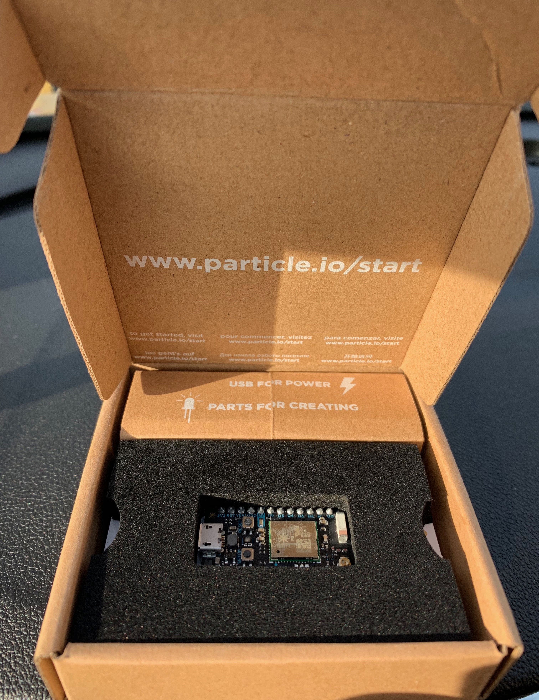
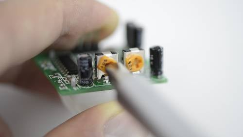
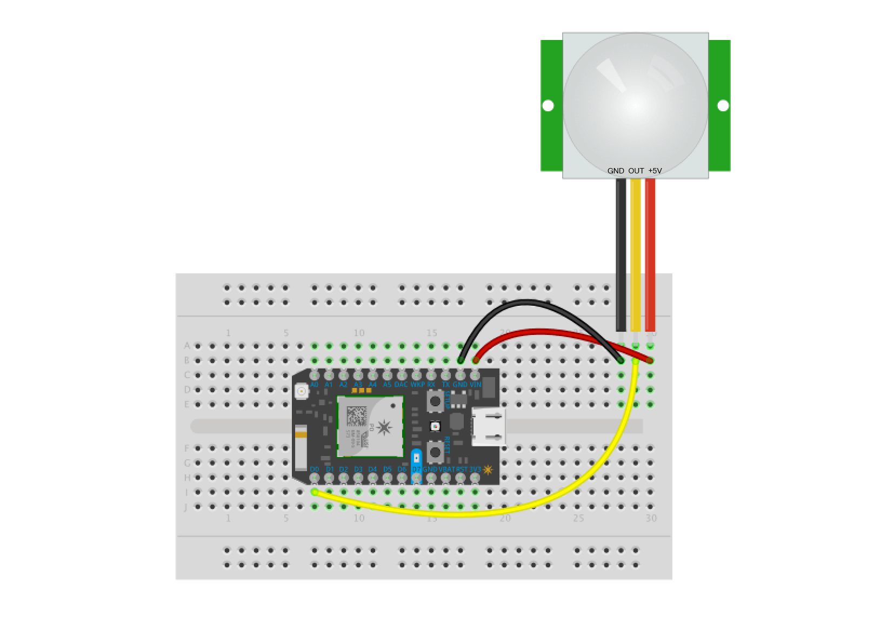
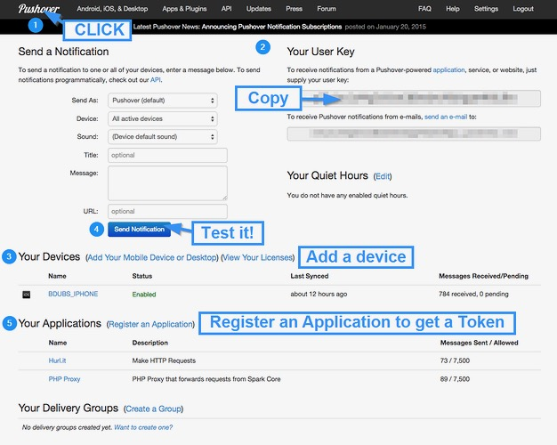
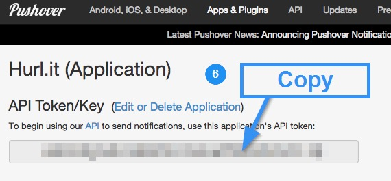
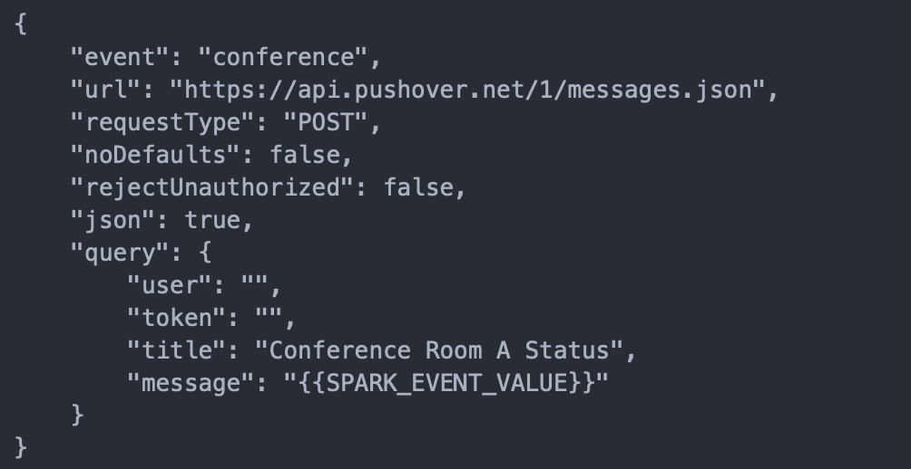

## Motion Sensor with Particle Photon

Required Parts:
<br>- Particle Photon [link](https://www.amazon.com/Particle-Reprogrammable-Development-Prototyping-Electronics/dp/B016YNU1A0)
<br>- Adafruit PIR (Motion) Sensor [link](https://www.amazon.com/gp/product/B012ZZ4LPM/ref=ppx_yo_dt_b_asin_title_o00_s00?ie=UTF8&psc=1)
<br>- OPTIONAL: PowerShield (Battery) [link](https://www.amazon.com/gp/product/B06XJ64G8G/ref=ppx_yo_dt_b_asin_title_o02_s00?ie=UTF8&psc=1)
<!---
[link](https://docs.particle.io/tutorials/hardware-projects/maker-kit/#tutorial-3-conference-room-monitor)
--->

### RESET PHOTON (SAFE MODE & WIFI) 
[reset photon](https://iotrvc.github.io/reset/)


### Step 1: Set up your Photon
- Using Your Computer: Go to particle.io/setup and follow the instructions to create an account and set up your Photon.
- Using Your Phone & Download the Particle Mobile App [iPhone](https://itunes.apple.com/us/app/particle-build-photon-electron/id991459054?ls=1&mt=8) & [Android](https://play.google.com/store/apps/details?id=io.particle.android.app) to create an account and set up your Photon.



<hr>

### Step 2: Connect Motion Sensor to Photon
- Connect your sensor to a digital or analog input on the Photon. Follow these examples for hooking up common sensors.
```
Sensor Pin | Photon Pin
       VCC | VIN 
       GND | GND 
       OUT | D0 
```
#### Set up the hardware

On the PIR sensor itself, with the back of the PCB facing up, find the two small potentiometers. The one on the left controls the range of the sensor (3-7 meters), and the one on the right controls how long the sensor stays triggered once tripped (1.5 - 300 seconds). 

Set the left (range potentiometer) to middle of dial. 

Set the right (timing potentiometer) all the way to the left (counterclockwise) to maximize its timing resolution.


<br>
Now we'll connect the PIR sensor to the Photon. Press the sensor into the upper-left corner of your breadboard, then connect it to the Photon as follows:
<br>


<hr>

### Step 3: Setup Push Notifications
To receive your push notification there is a little setup if you’ve never done it before, but once you do you’ll never have to touch it again. There are a ton of services you could use, but the one I like is Pushover.net. 

- Setup an account with [Pushover.net](https://pushover.net/) then follow these instructions:
- Follow below steps (see below image)





- Click on the Pushover logo to get to your dashboard.
- Copy your User Key. This is the value for the the user query field below.
- Add a device that is going to receive these push notifications. Primarily an iOS or Android phone/tablet… whatever you can download the Pushover app to.
- Send a test message and make sure it’s working!
- Register an application. Call it whatever you want it doesn’t really matter.
- When you are done click on the application’s name from step 5 and copy the API Token/Key from that page. This is the value for the token query field below.

<hr>

### Step 4: Create a WebHook

- Go to https://console.particle.io/integrations 
- Click on New Integration
- Change "Request Format" JSON
- Click WebHook > CUSTOM TEMPLATE
- Get code <a href="https://raw.githubusercontent.com/iotrvc/project1/master/trigger.txt">here</a> and Copy and replace user and token with above user key and API Token




- Click Create WebHook

<hr>

### Step 5: Create Particle App

- Go to https://build.particle.io/build/new 
- Title: Conference_Room_Monitor
- Paste Below Code

```
/*****************************************************************************
This tutorial uses a Photon and the PIR motion sensor from the Particle Maker
Kit to determine whether a conference room is in use (you could also use it
for many other applications) and post the status to PushOver.
******************************************************************************/

int ledPin = D7;                 // choose the pin for the LED
int inputPin = D0;               // choose the PIR sensor pin
bool available = false;                  // status of conference room
int motionCounter = 0;           // variable to count motion events

Timer timer(60000, determineMotion); // software timer to check every 30s

void setup() {
  pinMode(ledPin, OUTPUT);       // set LED as output
  pinMode(inputPin, INPUT);      // set sensor as input
  determineMotion();
  timer.start(); // start the determineMotion timer
}

void determineMotion() {    // this function determines if there's motion
    if(motionCounter < 1) { // if very little motion was detected
        if(available == false) { // only publish if the status changed
             Particle.publish("conference", "Confererence Room A is Available", PRIVATE);
            }
        available = true; // set the status to available
    } else if (motionCounter >= 1) {
        if(available == true) { // only publish if the status changed
            Particle.publish("conference", "Confererence Room A is In Use", PRIVATE);
            }
        available = false; // set the status to in use
    }
    motionCounter = 0; // reset motion counter
}

void loop() {
  if (digitalRead(inputPin) == HIGH) {  // check if the input is HIGH
    digitalWrite(ledPin, HIGH);         // turn LED ON if high
    motionCounter++;                    // increment motion counter
  } else {
    digitalWrite(ledPin, LOW);          // turn LED OFF if no input
  }
  delay(500);                           // wait 0.5s
}

```

- Click Save
- Click Flash

That’s It! You should now see notifications when motion is detected

If all goes well, the D7 LED on your Photon should light up when the sensor detects motion. Note that it stays tripped for a second or two, so it may appear to be sluggish. To make sure it's actually working, hold perfectly still for a few seconds, then move. You'll find that it's sensitive enough to detect very subtle motion, which is great.


