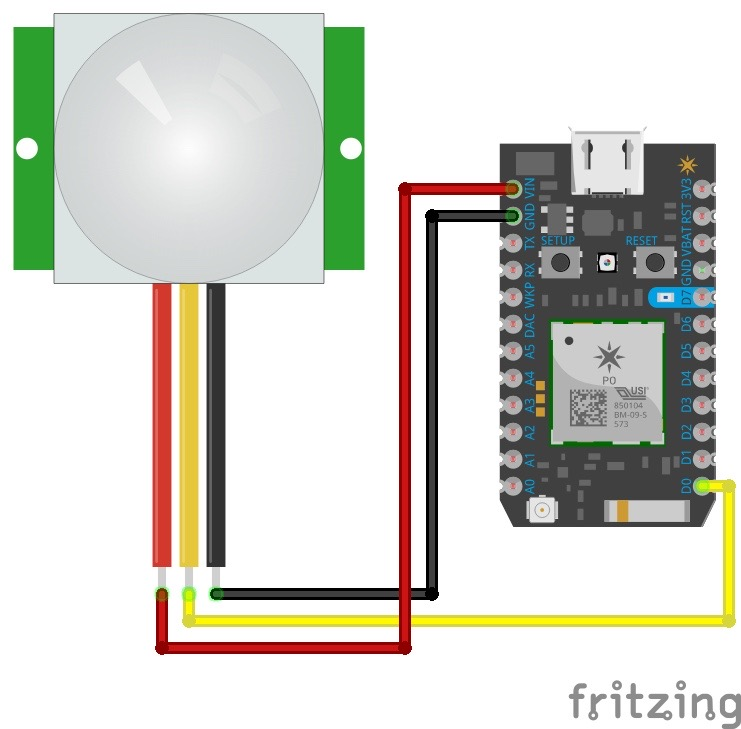

## Motion Sensor with Particle Photon

Required Parts:
Particle Photon Development Kit
Adafruit PIR (Motion) Sensor

### Step 1: Set up your Photon
* Using Your Computer: Go to particle.io/setup and follow the instructions to create an account and set up your Photon.
* Using Your Phone: Download the Particle Mobile App [iPhone | Android] to create an account and set up your Photon.

### Step 2: Connect Motion Sensor to Photon
Connect your sensor to a digital or analog input on the Photon. Follow these examples for hooking up common sensors.

Sensor Pin | Photon Pin
       VCC | VIN (RED)
       GND | GND (BLUE)
       OUT | D0 (YELLOW)




### Step 3: Setup Push Notifications
To receive your push notification there is a little setup if you’ve never done it before, but once you do you’ll never have to touch it again. There are a ton of services you could use, but the one I like is Pushover.net328. Setup an account with Pushover then follow these instructions:

- Setup New Account
- Follow below steps (see below image)





- Click on the Pushover logo to get to your dashboard.
- Copy your User Key. This is the value for the the user query field below.
- Add a device that is going to receive these push notifications. Primarily an iOS or Android phone/tablet… whatever you can download the Pushover app to.
- Send a test message and make sure it’s working!
- Register an application. Call it whatever you want it doesn’t really matter.
- When you are done click on the application’s name from step 5 and copy the API Token/Key from that page. This is the value for the token query field below.

### Step 4: Create a WebHook

- Go to https://console.particle.io/integrations 
- Click on New Integration
- Click WebHook > CUSTOM TEMPLATE
- Paste below text and replace user and token with above user key and API Token

{
  "eventName": "office-motion",
  "url": "https://api.pushover.net/1/messages.json",
  "requestType": "POST",
  "query":
  {
    "user": "YOUR_USER_KEY",
    "token": "YOUR_API_TOKEN_KEY",
    "title": "MOTION",
    "message": "{{SPARK_EVENT_VALUE}}"
  },
  "mydevices": true
}

- Click Create WebHook

### Step 5: Create Particle App

- Go to https://build.particle.io/build/new 
- Title: MotionHook
- Paste Below Code

#define PIR_PIN D0 // Replace D0 with the pin you used 
void setup() { 
   pinMode(PIR_PIN, INPUT); 
} 
void loop() { 
   // PIR_PIN goes HIGH when motion is detected, stays HIGH for a few seconds 
 if (digitalRead(D0) == HIGH) {
        Particle.publish("office-motion", "DiningRoom", 60, PRIVATE);
        while (digitalRead(D0) == HIGH); // hang tight here until motion stops
    }
} 

- Click Save
- Click Flash

That’s It! You should now see notifications when motion is detected


## Welcome to GitHub Pages

You can use the [editor on GitHub](https://github.com/iotrvc/project1/edit/master/README.md) to maintain and preview the content for your website in Markdown files.

Whenever you commit to this repository, GitHub Pages will run [Jekyll](https://jekyllrb.com/) to rebuild the pages in your site, from the content in your Markdown files.

### Markdown

Markdown is a lightweight and easy-to-use syntax for styling your writing. It includes conventions for

```markdown
Syntax highlighted code block

# Header 1
## Header 2
### Header 3

- Bulleted
- List

1. Numbered
2. List

**Bold** and _Italic_ and `Code` text

[Link](url) and 
```

For more details see [GitHub Flavored Markdown](https://guides.github.com/features/mastering-markdown/).

### Jekyll Themes

Your Pages site will use the layout and styles from the Jekyll theme you have selected in your [repository settings](https://github.com/iotrvc/project1/settings). The name of this theme is saved in the Jekyll `_config.yml` configuration file.

### Support or Contact

Having trouble with Pages? Check out our [documentation](https://help.github.com/categories/github-pages-basics/) or [contact support](https://github.com/contact) and we’ll help you sort it out.
